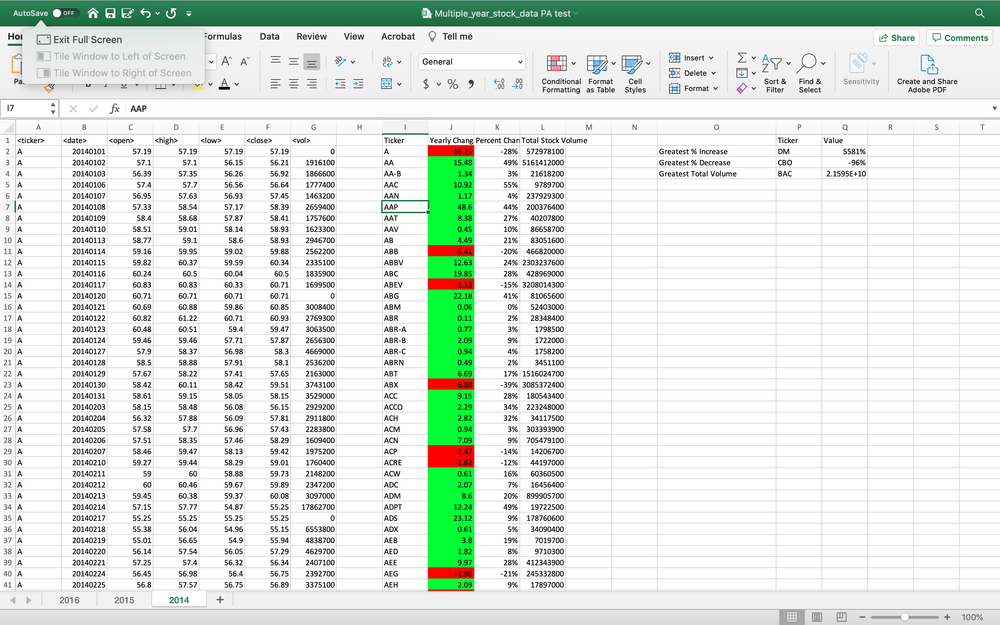
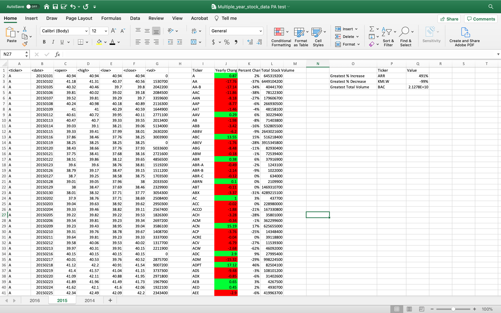
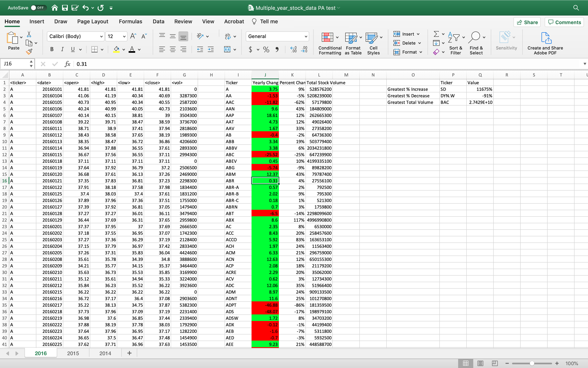

# VBA Homework - The VBA of Wall Street

VBA scripting is used to analyze real stock market data. 

### Files

* [Test Data](Resources/alphabetical_testing.xlsx) - Used in developing scripts.

* [Stock Data](Resources/Multiple_year_stock_data.xlsx) - Used to run scripts  and generate the final homework report. 

## Procedure

* Created a script that loops through all the stocks for one year and output the following information.

  * The ticker symbol.

  * Yearly change from opening price at the beginning of a given year to the closing price at the end of that year.

  * The percent change from opening price at the beginning of a given year to the closing price at the end of that year.

  * The total stock volume of the stock.

* Conditional formatting is used to highlight positive change in green and negative change in red.

* The solution is also able to return the stock with the "Greatest % increase", "Greatest % decrease" and "Greatest total volume." 

## Screenshots of each year's summary

# 2014

# 2015

# 2016

